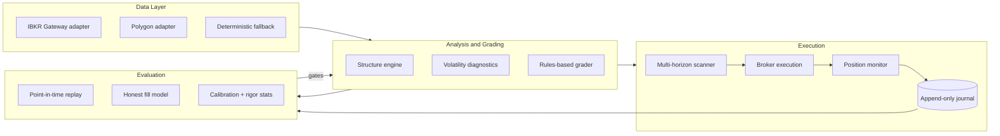

# Bliss

**A systematic trading-research platform engineered so it cannot lie to its operator.**
Built end-to-end by one operator directing Claude (research → implementation → operations).
The working strategy code is private; this repository is the complete technical
documentation of the architecture, evaluation methodology, and operational design.

> Current honest status (July 2026): paper-trading a $1,000 forward test through
> Interactive Brokers. Measured edge under execution-faithful evaluation: **zero** —
> reported plainly, because producing that number honestly is the system's core feature.

---

## What it is

Bliss is three cooperating systems:

1. **The Brain** — market-structure analysis (swing/BOS/CHoCH detection, supply–demand
   zones, fair-value gaps, liquidity sweeps, volatility diagnostics) fused by a
   transparent rules engine into graded trade theses: `Prime / Valid / Watch / Avoid`,
   each with entry/stop/target geometry, contract fit, and plain-English
   why / confirms / invalidates.
2. **The Ruler** — a point-in-time evaluation stack that decides what is true:
   no-lookahead replay, an execution-faithful fill model, per-grade calibration,
   and overfitting surveillance. Nothing influences a grade until it wins here.
   See [EVALUATION.md](docs/EVALUATION.md).
3. **The Agent** — an autonomous execution layer (currently paper) with hard risk
   rails: fixed-fractional sizing, a global daily kill switch, correlation netting,
   account-regulation awareness (PDT budgets, settled-funds ledgers), and an
   append-only journal as the single source of record.
   See [ARCHITECTURE.md](docs/ARCHITECTURE.md) and [OPERATIONS.md](docs/OPERATIONS.md).

## Stack

| Layer | Technology |
|---|---|
| Backend | Python 3.12, FastAPI, `ib_async` (single-worker executor, hard timeouts, self-healing reconnect) |
| Analysis / backtest | Pure-Python, dependency-light modules; property-based no-lookahead tests |
| ML | Deterministic logistic meta-labeler (calibration-first); gradient-boosted models deferred until data depth earns them |
| Frontend | Next.js, canvas-drawn chart primitives (zones, FVGs, BOS/CHoCH markers, R/R bands) |
| Persistence | Append-only JSONL journal (trades), SQLite (UI state), filesystem reports |
| Ops | Three `launchd` services (agent daemon, API, web), scheduled readiness/report tasks, notification sentinel |
| Test suite | 230 pytest tests; suite-green is a hard commit gate |

## Engineering principles (the ones that cost something)

- **No-lookahead as a tested property, not a convention.** At bar *i* every read sees
  `candles[:i+1]` only; tests assert that appending future bars cannot change an
  earlier read.
- **Default-OFF candidates.** Every new signal ships behind a flag, byte-identical to
  baseline when off, and earns influence only through an A/B on the fixed ruler.
  Rejections are retained as first-class results.
- **Execution-faithful evaluation.** Outcomes count only if the entry actually trades;
  the fill model mirrors live pending-order semantics exactly. Replacing the naive
  fills-always assumption erased a +0.65R/attempt bias from every prior baseline —
  the defining case study of this project ([EVALUATION.md §5](docs/EVALUATION.md)).
- **Trust is rented.** The ML layer's sizing authority scales only with verified
  out-of-sample reliability per confidence bucket (Wilson lower bound) and revokes
  automatically on decay.
- **Live trading is disabled in code, not configuration.** The live broker constructor
  raises unconditionally; enabling it is a reviewed code change behind a rigor bar
  and explicit per-market sign-off.
- **The journal is sacred.** Append-only, real data only, cancels excluded from hit
  rate, every reported number reproducible from it.

## Build process

Bliss was built in weeks by one non-professional developer directing Claude across
three surfaces: research chats producing 20 primary-source dossiers; Claude Code
implementing staged specifications (implement → test → grade → verdict → stop for
human review, one stage per commit); and a Cowork session operating services,
schedules, and verification on the host machine. A single handoff document
(`SESSION_STATE.md`) makes any fresh session fully operational in one read.
Stacked draft PRs, conventional commits, secrets and records gitignored.

## Repository map

| Document | Contents |
|---|---|
| [docs/ARCHITECTURE.md](docs/ARCHITECTURE.md) | Layers, data flow, module responsibilities, fleet design (multi-market agents over one risk core) |
| [docs/EVALUATION.md](docs/EVALUATION.md) | The ruler: replay, fill-model semantics, calibration, rigor statistics, A/B protocol, phantom-fill postmortem |
| [docs/OPERATIONS.md](docs/OPERATIONS.md) | Services, scheduling, notifications, risk rails, account-law compliance, live-enable protocol |

## What is deliberately not here

Strategy parameters, grading thresholds, the research dossiers, entry/exit candidate
specifics, and all trading records. The methodology is shareable; the edge under
construction is not.

---

*Bliss is a research project. Nothing here is financial advice; no returns are
promised or implied. Documentation © 2026 Cedric Lewis II — shared for review;
all rights reserved.*
