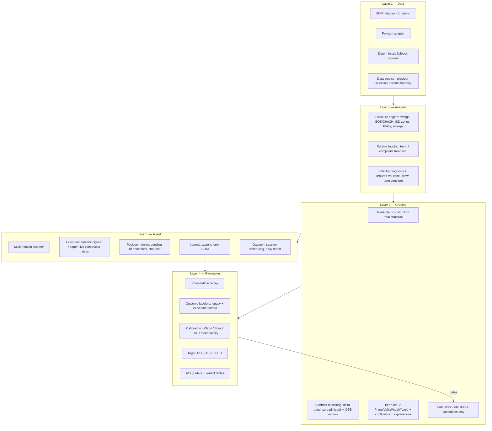
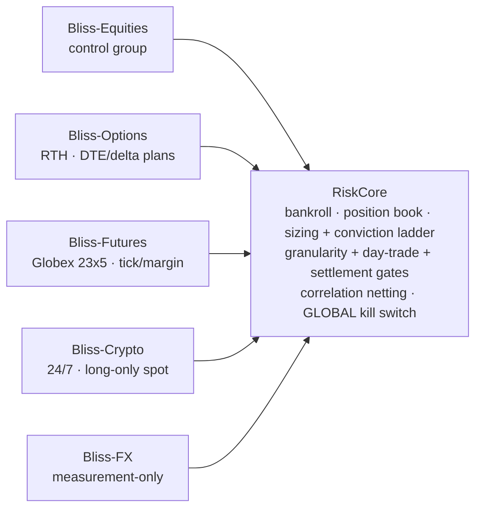

# Architecture

Bliss is a layered system with one deliberate asymmetry: the evaluation layer
(the "ruler") sits *above* the analysis layer in authority. Analysis proposes;
evaluation disposes.

## Layer notes

### Data
Adapters share one interface (`get_candles`, `get_option_chain`) and degrade
honestly: every response carries provider + status, and synthetic fallback can
never masquerade as real (`require_real_data` gates the record). The IBKR
adapter routes all calls through a dedicated single-worker executor with hard
timeouts and a self-healing reset, because `ib_async` is not thread-safe. A
full-coverage test binds the timeframe enum to the adapter's bar-size map —
the regression pin from a silent daily-bars bug (see EVALUATION.md §6).

### Analysis
Pure functions over candle lists; no I/O, no state, no future access. The
structure engine emits a typed read (bias, swings, events, zones, FVGs,
sweeps); volatility diagnostics compute a Burghardt–Lane realized-vol cone,
OTM-put-minus-ATM skew, and an ATM term structure with an inverted-front event
flag from the broker's own chain — no paid IV history required.

### Grading
`build_trade_plan` derives entry/stop/targets from zone and swing geometry;
`score_contract_fit` checks the vehicle (delta band, spread ceiling, open
interest / volume floor, DTE window per horizon); tier rules assign the grade
and a confluence score ranks within tiers. Every output carries
why / confirms / invalidates in plain English. Candidate gates (liquidity
sweep-and-flip, trend-regime, volatility gates, ML veto) plug into explicit
default-OFF slots; when off, output is byte-identical to baseline — enforced
by test. Two standing rules: no gate may promote a setup the base rules called
Avoid, and correlated senses are fused before they are counted.

### Evaluation
The authority layer — documented fully in [EVALUATION.md](EVALUATION.md).

### Agent
The scanner walks a ~300-symbol universe in rotating slices across a 7-rung
horizon ladder (scalp → year), each rung owning its bar size, hold budget, and
options DTE window. Execution submits through the paper broker; the monitor
enforces pending-fill semantics identical to the evaluation fill model (the
live/backtest symmetry is the point), stop-first same-bar resolution, and
horizon time-stops. Every event — open, fill, cancel (with reason), close,
halt — appends to the journal, from which the daily report and all statistics
are derived. `make_broker("live")` raises unconditionally.

## Fleet design (staged)

The next architectural stage generalizes the single agent into market agents
over one shared risk core:

Design invariants: no order exists without RiskCore approval; the kill switch
is one number across all agents, books, and accounts, resetting at 17:00 ET;
the same underlying across any books nets to one position; each market ×
horizon cell graduates independently (dry-run → paper → live) on its own
measured record; a shares agent serves as the control group every other
vehicle must beat net-of-costs. Horizon books (intraday / swing / position)
live *inside* each market agent — timeframes are books sharing the market's
plumbing, not separate agents.

## Frontend

Next.js site: dashboard with canvas-drawn chart primitives (S/D zones, FVG
boxes, BOS/CHoCH markers, R/R bands, 7-rung horizon picker), scanner, journal
(hit rate with Wilson CI, day-return, bankroll), watchlists, research, and an
explain/ask layer that answers only from computed facts. A Growth page
(equity curve with drawdown underlay, trade tape including honest misses,
bootstrap projection fans with percentile bands) is in progress.
